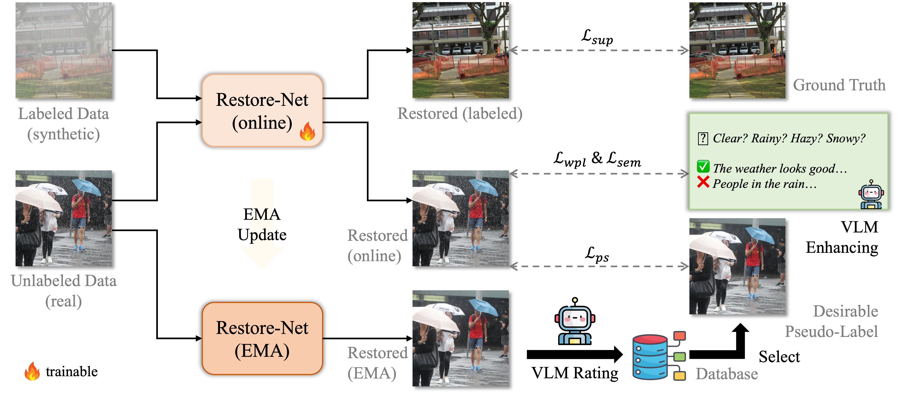

# WResVLM

Implementation of **WResVLM**, from the following paper:

Towards Real-World Adverse Weather Image Restoration: Enhancing Clearness and Semantics with Vision-Language Models (ECCV 2024)

Jiaqi Xu, Mengyang Wu, Xiaowei Hu, Chi-Wing Fu, Qi Dou, Pheng-Ann Heng

## Datasets

We use several (pseudo-)synthetic datasets, including [Outdoor-Rain](https://github.com/liruoteng/HeavyRainRemoval), [RainDrop](https://github.com/rui1996/DeRaindrop), [SPA](https://github.com/zhuyr97/WGWS-Net), [OTS](https://sites.google.com/view/reside-dehaze-datasets/reside-%CE%B2), [Snow100K](https://sites.google.com/view/yunfuliu/desnownet).
Meanwhile, we use real-world data from [URHI](https://sites.google.com/view/reside-dehaze-datasets/reside-%CE%B2) and our collected real rain and snow images for model training.
The real rain and snow images used for training can be downloaded [here](https://appsrv.cse.cuhk.edu.hk/~jqxu/data/WResVLM/WReal.zip).
The 2,320 filtered real rain images from [DDN-SIRR](https://github.com/wwzjer/Semi-supervised-IRR) and [Real3000](https://github.com/Yueziyu/RainDirection-and-Real3000-Dataset), used for testing, can be downloaded [here](https://appsrv.cse.cuhk.edu.hk/~jqxu/data/WResVLM/RealRain_2320.zip).
The [Snow100K-realistic](https://sites.google.com/view/yunfuliu/desnownet) dataset can be downloaded [here](https://appsrv.cse.cuhk.edu.hk/~jqxu/data/WResVLM/Snow100K_realistic.zip).

## Acknowledgements

We would like to express our gratitude for the codes, including [Q-Align](https://github.com/Q-Future/Q-Align), which are the bases for building our project.

## License

This project is for academic research purposes and released under the [MIT license](./LICENSE).
Parts of this project use code, data, and models from other sources, which are subject to their respective licenses.
