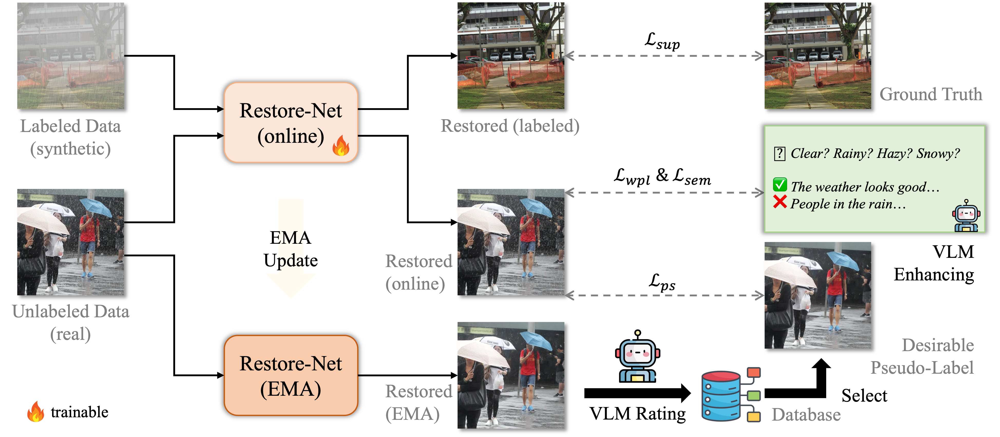

# WResVLM

Implementation of **WResVLM**, from the following paper:

Towards Real-World Adverse Weather Image Restoration: Enhancing Clearness and Semantics with Vision-Language Models (ECCV 2024)

Jiaqi Xu, Mengyang Wu, Xiaowei Hu, Chi-Wing Fu, Qi Dou, Pheng-Ann Heng

Code coming soon.
